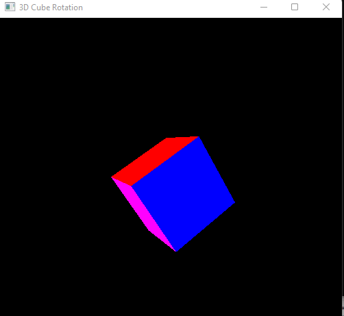

# 3D-Cube-Rotation-Using-Glut

# Project Description
Through this project I would like to rotate a multi colored Cube in 3 dimension. The output of the project will be the projection of 3D Cube Rotation

- First we draw multiple Squares,
- Then Depth is cleared and Roation Angle applied,
- Finally Because of the Rotation the 3D Cube Shows up

# System Usuages

- Code Blocks
- OpenGL Primitives

# System Properties

- Multiple Squares
- Rotation

# How to Install and Run the Project

1. Download & Install GLUT
2. Download main.cpp file
3. Run on Codeblocks

# Output

# Video Explanation

Explainer Video On Youtube: [Visit This Link](https://youtu.be/PNompyAhHBs)
